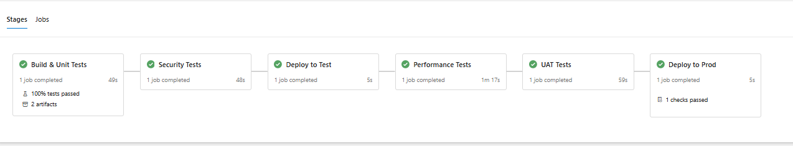
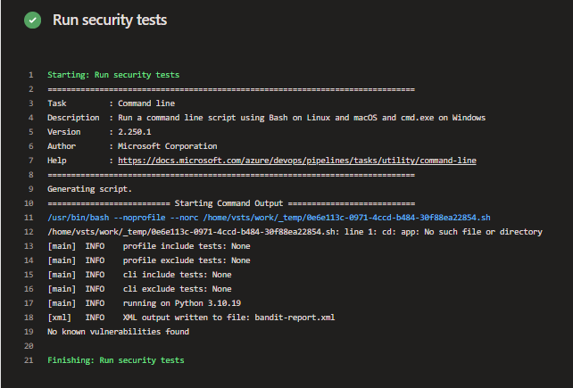
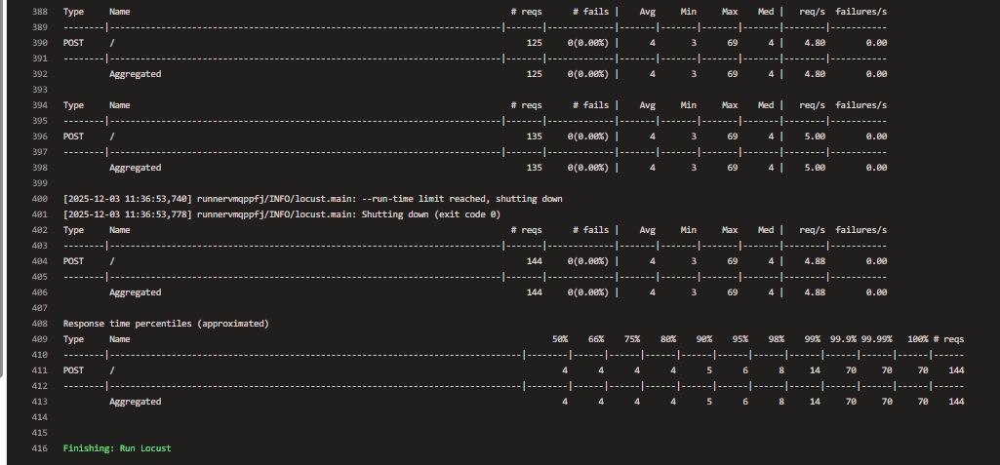
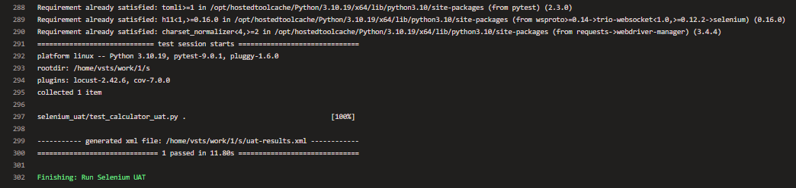
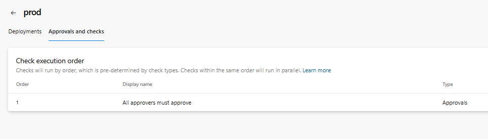

# x00195672_CA2

# Project Name
Calculator Application

## Overview
For my ca2/project I created a Python Calculator application that applies and shows many of the devops methodologies and practices. Continuous integrations (CI) was implemented using Azure Devops Pipelines, Unit Testing was implemented using pytest, Static Code analysis in CI was done with Pylint, I made sure to get above 80% coverage for the project as required, one point to note is a had to make the repository public in order to implement the "Branch Protection Rules" as a private repository would allow for creations of these rules, also as required i was working in 2 branches the main and the devlopment and then merged the development branch into the main through a pull request.

## Technologies Used
Python 
PyTest
PyTest-cov
pylint
Azure Devops Pipelines
GitHub Branch Protection
Git 

## Local Development Setup
To run this project locally here is a step by step guide (In cmd):
1. Copy the repository
git clone "copy the repository from github"

2. Go into the cloned repository location
cd "location of the clones repository"

3. Create the virtual enviroment 
python -m venv venv

4. Activate the virtual enviroment
venv\Scripts\activate

5. Install the requirements
pip install -r requirements.txt

## Application Features
The features of the calculator application are: 
1. Adding of two numbers 

2. Subtracting of two numbers

3. Multiplication of two numbers

4. Divison of two numbers

## CI Pipeline Implementation
The CI pipeline for this project was built using Azure Devops Pipelines. This pipeline included installation of Python and dependencies, implementation of Pylint for static analysis, as well as Pytest for running tests with coverage, enforcement of 80 percent coverage as required, and publishing the results with XML. Below I leave a snippet of my pipeline implementation as well as the job running with 100 percent coverage in Azure.

## Branch Policies and Protection
As mentioned before, for the duration of this project ill have the repository set to public in order to implement proper protection through branch policies. As for the rules implemented for the main branch, various rules were enabled, like:
1. Require pull request before merging

2. Require status checks to pass before merging (set to the azure pipeline)

3. Require branches to be up to date

These rules prevent direct pushes to the main and make sure that only validated, tested and reviewed code is merged, bellow I leave a snippet of the implemented rules for protection

## Testing Strategy
When it comes to testing startegy that was implemented using pytest which I used to test all the functions in the calculator app as well as the exception if the value passed is 0 for the division function. With the testing the goal was to achive an above 80 percent coverage which was achived in the end. Another testing feature was that if the coverage was below 80 percent the pipeline would fail. Below I leave a snippet of the test class as well as the coverage results.

## Troubleshooting Guide
As for troubleshooting the application, two things I encountered intitialy when working on the applicaiton were that the pipeline was not detecting pylint or pytest, where a message "module not found" occured. This was resolved with the following command "python -m pip install pytest pytest cov pylint". Another issue that I already talked about as well, but needs to be mentioned in this section, is the fact that for the branch protection rule, if it were to be missing, its caused due to the fact that the repository is set to private instead of public. Changing it to public fixes the issue. Last troubleshooting tip would be, if the coverage is failing, make sure that all the functions have a test.

## Environment Setup and Configuration
For the environment set up and configuration of this project starting off im using python 3.10 and several other tools that are used for testing, security or automation, and when it comes to automation all of it is handled by azure devops pipeline 

- we use "UsePythonVersion@0 to set the correct runtime python version of 3.10
- The dependencies are installed using "pip install -r requirements.txt" as mentioned before its also worth to mention that you need to have an up to date version of pip installed in which case we could run "python -m pip install --upgrade pip"
- as for the installation of UAT, Bandit, pip-audit or locust for performance testing the installation are done during run time directly in the each of the stages so once locust is beinmg run its only then that locust is actually being installed
- the pipeline extracts build artifacts before deploying using "unzip drop/drop.zip -d app" before deploying
- and as for the UAT & Performance tests the flask servers are run in the background using "nohup python calculator_web.py > flask.log 2>&1 &"
echo $! > flask.pid

## Deployment Process
The Deployment process is a multi-stage continuous delivery process in which all the previous stages have to work/pass tests in order to reach production, this ensures the whole pipeline works in this case our multi stage pipeline follows this structure 
-Build & Test Stage
-Security Testes Stage
-Deploy to Tests Stage
-Performance Tests Stage 
-UAT Stage 
-Deploy to Production Stage

## Security and Performance Testing
For Security Bandit was used as well as pip-audit. Bandit checks security issues in the python code "bandit -r calculator_app calculator_web.py -f xml -o bandit-report.xml" this is the piece of code where we use Bandit, while pip-audit scans dependencies for any issues used with the following code "pip-audit -r requirements.txt --output pip-audit-report.json". when it comes to performance Locust was used with this piece of code "locust -f performance/locust.py --headless -u 10 -r 2 -t 30s -H http://127.0.0.1:1234" so here we essentially set the amount of users to 10 add 2 users every second and the duration is 30 seconds.

## UAT Testing with Selenium
The User Acceptance Testing is started off with the set up of a flask server after which the local server is used which in this case is the http 1234 server "export BASE_URL=http://127.0.0.1:1234" and "pytest selenium_uat --junitxml=uat-results.xml" this executes the tests essentailly opening  a real chrome webdriver and performing tests on the calculations as if another person would.

## Pipeline Approval Gates
The approval gates implemented through githubs branch protection where the following protection is applied "Require at least one approval"
this stops pull request to be automatically created by the developer and needs to be approved by another person during the pull request assuming the pipeline passes all the tests, along deploy to prod also needs to be approved before being executed.

